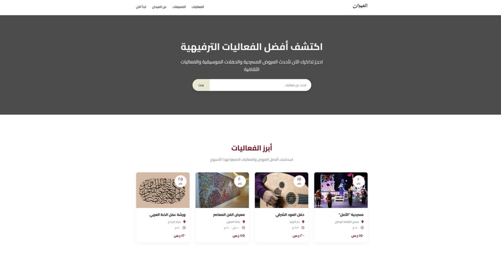
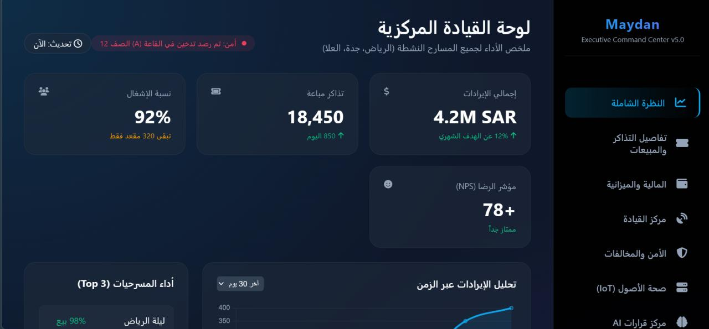
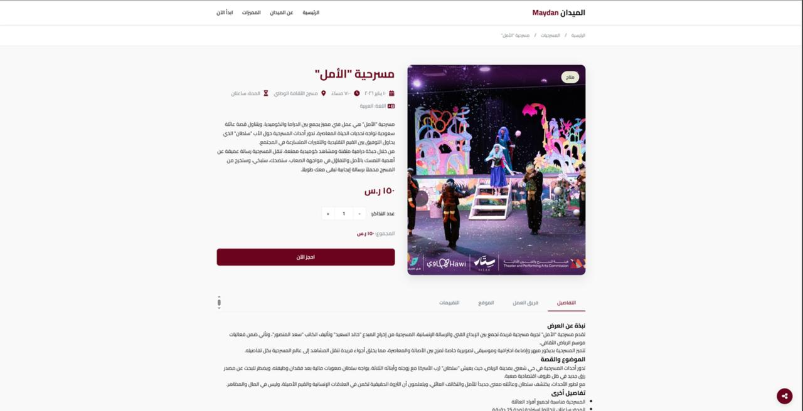

# Maydan – TheaterThon 2 Hackathon

## Overview
**Maydan** is a cloud-based platform bridging **Art and Management** in theaters and cultural centers.  
It transforms traditional manual processes into a smart, data-driven system, enabling theater managers to make informed decisions and improve audience experience.

**Impact:**
- Empowered theater professionals with real-time insights  
- Reduced operational inefficiencies  
- Converted audience and financial data into actionable strategies  

---

## Key Contributions & Solutions
- Designed AI algorithms to coordinate schedules, staff, and resources, improving operational efficiency  
- Developed interactive dashboards with predictive insights for better planning and decision-making  
- Built financial tracking tools to monitor revenue and expenses  
- Analyzed audience behavior to improve marketing and ticketing strategies  

**Role:** Full-stack development & AI-powered analytics  

---

## Technologies
- Frontend: HTML, CSS, JavaScript  
- Backend / AI: Python  

---

## Screenshots

### Home Page
<p align="center">
  
</p>

---

### Executive Dashboard
<p align="center">
  
</p>

---

### Show Details
The Show Details page presents event information including description, cast, venue, pricing, and booking option in an interactive layout.

<p align="center">
  
</p>

---

### Booking Confirmation
Displays confirmed ticket details, event info, seat selection, and countdown timer with options to download or share the ticket.

<p align="center">
  
</p>

---

## How to Run
1. Open `index.html` in a modern browser (Chrome, Firefox, Edge)  
2. For backend/AI features:
```bash
pip install -r requirements.txt
